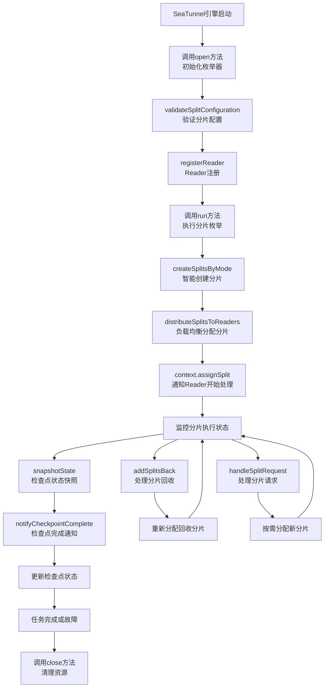

```mermaid
graph TD
    A[SeaTunnel引擎启动] --> B[调用open方法<br/>初始化枚举器]
    B --> C[validateSplitConfiguration<br/>验证分片配置]
    C --> D[registerReader<br/>Reader注册]
    D --> E[调用run方法<br/>执行分片枚举]
    E --> F[createSplitsByMode<br/>智能创建分片]
    F --> G[distributeSplitsToReaders<br/>负载均衡分配分片]
    G --> H[context.assignSplit<br/>通知Reader开始处理]
    H --> I[监控分片执行状态]
    I --> J[addSplitsBack<br/>处理分片回收]
    I --> K[handleSplitRequest<br/>处理分片请求]
    I --> L[snapshotState<br/>检查点状态快照]
    L --> M[notifyCheckpointComplete<br/>检查点完成通知]
    J --> N[重新分配回收分片]
    K --> O[按需分配新分片]
    M --> P[更新检查点状态]
    N --> I
    O --> I
    P --> Q[任务完成或故障]
    Q --> R[调用close方法<br/>清理资源]
```
