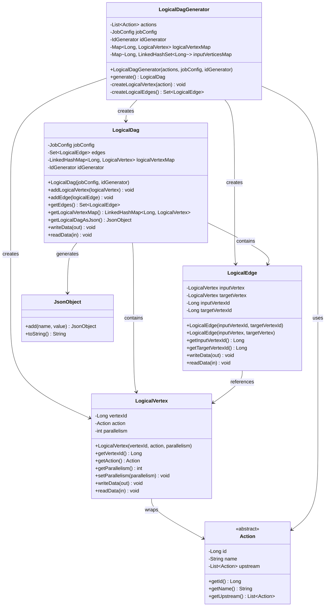

# SeaTunnel执行框架完整分层架构调用关系详解

## 文档概述

本文档深入分析SeaTunnel执行引擎的完整分层架构调用关系，从客户端作业提交到底层具体任务执行的全流程。涵盖11层架构的职责分工、调用时序、异常传播机制和最佳实践。基于SeaTunnel 2.3.x版本源码分析，为开发者提供生产级别的技术指导。

## 完整分层架构总览

SeaTunnel执行框架采用11层分层架构，实现了从作业提交到任务执行的完整调用链：

```
第1层: Client Layer (客户端层)
    ↓
第2层: Job Configuration Parsing Layer (作业配置解析层)
    ↓
第3层: Logical DAG Layer (逻辑DAG层)
    ↓
第4层: Execution Plan Layer (执行计划层)
    ↓
第5层: Physical Plan Generation Layer (物理计划生成层)
    ↓
第6层: Job Master Layer (作业主控层)
    ↓
第7层: Physical Plan Layer (物理执行计划层)
    ↓
第8层: SubPlan/Pipeline Layer (子计划层)
    ↓
第9层: Physical Vertex Layer (物理顶点层)
    ↓
第10层: Task Execution Service Layer (任务执行服务层)
    ↓
第11层: Concrete Task Layer (具体任务层)
```

### 完整架构关系图

上图展示了完整架构的层次关系，从第1层到第11层的自顶向下控制流，以及从第11层到第1层的自底向上状态汇报流。

## 各层职责详解

### 第1层: Client Layer (客户端层)

**核心类**:
- `org.apache.seatunnel.engine.client.SeaTunnelClient`
- `org.apache.seatunnel.engine.client.job.ClientJobExecutionEnvironment`
- `org.apache.seatunnel.engine.client.job.ClientJobProxy`

**主要职责**:
- 接收客户端作业提交请求
- 管理与SeaTunnel集群的连接
- 作业状态监控和结果获取
- 提供作业生命周期管理接口

**第1层类关系图**:


**关键实现**:

```java
// seatunnel-engine/seatunnel-engine-client/src/main/java/org/apache/seatunnel/engine/client/job/ClientJobExecutionEnvironment.java:171-186
public ClientJobProxy execute() throws ExecutionException, InterruptedException {
    JobImmutableInformation jobImmutableInformation =
            new JobImmutableInformation(
                    Long.parseLong(jobConfig.getJobContext().getJobId()),
                    jobConfig.getName(),
                    isStartWithSavePoint,
                    seaTunnelHazelcastClient.getSerializationService(),
                    getLogicalDag(),
                    new ArrayList<>(jarUrls),
                    new ArrayList<>(connectorJarIdentifiers));

    return jobClient.createJobProxy(jobImmutableInformation);
}
```

### 第2层: Job Configuration Parsing Layer (作业配置解析层)

**核心类**:
- `org.apache.seatunnel.engine.core.parse.MultipleTableJobConfigParser`
- `org.apache.seatunnel.engine.core.parse.JobConfigParser`

**主要职责**:
- 解析HOCON格式的作业配置文件
- 创建Source、Transform、Sink的Action对象
- 处理多表作业配置
- 管理插件Jar包依赖

**第2层类关系图**:


**核心解析流程**:

```java
// seatunnel-engine/seatunnel-engine-core/src/main/java/org/apache/seatunnel/engine/core/parse/MultipleTableJobConfigParser.java:217-283
public ImmutablePair<List<Action>, Set<URL>> parse(ClassLoaderService classLoaderService) {
    // 1. 解析配置文件，提取source、transform、sink配置
    List<? extends Config> sourceConfigs = TypesafeConfigUtils.getConfigList(seaTunnelJobConfig, "source", Collections.emptyList());
    List<? extends Config> transformConfigs = TypesafeConfigUtils.getConfigList(seaTunnelJobConfig, "transform", Collections.emptyList());
    List<? extends Config> sinkConfigs = TypesafeConfigUtils.getConfigList(seaTunnelJobConfig, "sink", Collections.emptyList());

    // 2. 处理插件Jar包依赖
    List<URL> sourceConnectorJarAndDependencies = getConnectorJarAndDependencyList(sourceConfigs, PluginType.SOURCE);
    List<URL> sinkConnectorJarAndDependencies = getConnectorJarAndDependencyList(sinkConfigs, PluginType.SINK);
    
    // 3. 创建类加载器
    ClassLoader sourceClassLoader = getClassLoader(classLoaderService, parentClassLoader, sourceConnectorJarAndDependencies);
    ClassLoader sinkClassLoader = getClassLoader(classLoaderService, parentClassLoader, sinkConnectorJarAndDependencies);

    // 4. 解析各类型Action
    LinkedHashMap<String, List<Tuple2<CatalogTable, Action>>> tableWithActionMap = new LinkedHashMap<>();
    
    // 解析Source
    for (int configIndex = 0; configIndex < sourceConfigs.size(); configIndex++) {
        Config sourceConfig = sourceConfigs.get(configIndex);
        Tuple2<String, List<Tuple2<CatalogTable, Action>>> tuple2 = 
            parseSource(configIndex, sourceConfig, sourceClassLoader);
        tableWithActionMap.put(tuple2._1(), tuple2._2());
    }
    
    // 解析Transform
    parseTransforms(transformConfigs, sourceClassLoader, tableWithActionMap);
    
    // 解析Sink
    List<Action> sinkActions = new ArrayList<>();
    for (int configIndex = 0; configIndex < sinkConfigs.size(); configIndex++) {
        Config sinkConfig = sinkConfigs.get(configIndex);
        sinkActions.addAll(parseSink(configIndex, sinkConfig, sinkClassLoader, tableWithActionMap, isMultipleTableJob));
    }
    
    return new ImmutablePair<>(sinkActions, allJarUrls);
}
```

### 第3层: Logical DAG Layer (逻辑DAG层)

**核心类**:
- `org.apache.seatunnel.engine.core.dag.logical.LogicalDagGenerator`
- `org.apache.seatunnel.engine.core.dag.logical.LogicalDag`
- `org.apache.seatunnel.engine.core.dag.logical.LogicalVertex`
- `org.apache.seatunnel.engine.core.dag.logical.LogicalEdge`

**主要职责**:
- 将Action列表转换为逻辑有向无环图(DAG)
- 管理逻辑顶点和边的关系
- 提供DAG的序列化和反序列化
- 支持DAG的可视化表示

**第3层类关系图**:



**关键数据结构**:

```java
// seatunnel-engine/seatunnel-engine-core/src/main/java/org/apache/seatunnel/engine/core/dag/logical/LogicalDag.java:56-169
@Slf4j
public class LogicalDag implements IdentifiedDataSerializable {
    @Getter private JobConfig jobConfig;
    private final Set<LogicalEdge> edges = new LinkedHashSet<>();
    private final LinkedHashMap<Long, LogicalVertex> logicalVertexMap = new LinkedHashMap<>();
    private IdGenerator idGenerator;

    public void addLogicalVertex(LogicalVertex logicalVertex) {
        logicalVertexMap.put(logicalVertex.getVertexId(), logicalVertex);
    }

    public void addEdge(LogicalEdge logicalEdge) {
        edges.add(logicalEdge);
    }
    
    // DAG转换为JSON格式用于可视化
    @NonNull public JsonObject getLogicalDagAsJson() {
        JsonObject logicalDag = new JsonObject();
        JsonArray vertices = new JsonArray();
        
        logicalVertexMap.values().stream().forEach(v -> {
            JsonObject vertex = new JsonObject();
            vertex.add("id", v.getVertexId());
            vertex.add("name", v.getAction().getName() + "(id=" + v.getVertexId() + ")");
            vertex.add("parallelism", v.getParallelism());
            vertices.add(vertex);
        });
        
        return logicalDag;
    }
}
```

**DAG生成流程**:

```java
// seatunnel-engine/seatunnel-engine-core/src/main/java/org/apache/seatunnel/engine/core/dag/logical/LogicalDagGenerator.java:69-102
public LogicalDag generate() {
    // 1. 遍历所有Action，创建LogicalVertex
    actions.forEach(this::createLogicalVertex);
    
    // 2. 根据Action的上游依赖关系创建LogicalEdge
    Set<LogicalEdge> logicalEdges = createLogicalEdges();
    
    // 3. 构建最终的LogicalDag
    LogicalDag logicalDag = new LogicalDag(jobConfig, idGenerator);
    logicalDag.getEdges().addAll(logicalEdges);
    logicalDag.getLogicalVertexMap().putAll(logicalVertexMap);
    
    return logicalDag;
}

private void createLogicalVertex(Action action) {
    final Long logicalVertexId = action.getId();
    if (logicalVertexMap.containsKey(logicalVertexId)) {
        return;
    }
    
    // 递归处理上游Action
    action.getUpstream().forEach(inputAction -> {
        createLogicalVertex(inputAction);
        inputVerticesMap.computeIfAbsent(inputAction.getId(), id -> new LinkedHashSet<>())
                       .add(logicalVertexId);
    });

    final LogicalVertex logicalVertex = new LogicalVertex(logicalVertexId, action, action.getParallelism());
    logicalVertexMap.put(logicalVertexId, logicalVertex);
}

private Set<LogicalEdge> createLogicalEdges() {
    return inputVerticesMap.entrySet().stream()
            .map(entry -> entry.getValue().stream()
                    .map(targetId -> new LogicalEdge(entry.getKey(), targetId))
                    .collect(Collectors.toList()))
            .flatMap(Collection::stream)
            .collect(Collectors.toCollection(LinkedHashSet::new));
}
```

### 第4层: Execution Plan Layer (执行计划层)

**核心类**:
- `org.apache.seatunnel.engine.server.dag.execution.ExecutionPlanGenerator`
- `org.apache.seatunnel.engine.server.dag.execution.ExecutionPlan`
- `org.apache.seatunnel.engine.server.dag.execution.Pipeline`
- `org.apache.seatunnel.engine.server.dag.execution.ExecutionVertex`
- `org.apache.seatunnel.engine.server.dag.execution.ExecutionEdge`

**主要职责**:
- 将逻辑DAG转换为可执行的执行计划
- 进行执行优化(Transform链合并、Shuffle优化)
- 生成Pipeline列表
- 管理执行顶点和边的并行度

**第4层类关系图**:


**核心转换过程**:

```java
// seatunnel-engine/seatunnel-engine-server/src/main/java/org/apache/seatunnel/engine/server/dag/execution/ExecutionPlanGenerator.java:75-96
public ExecutionPlan generate() {
    log.debug("Generate execution plan using logical plan:");

    // 第1阶段: 将逻辑边转换为执行边
    Set<ExecutionEdge> executionEdges = generateExecutionEdges(logicalPlan.getEdges());
    log.debug("Phase 1: generate execution edge list {}", executionEdges);

    // 第2阶段: 进行Transform链合并优化
    executionEdges = generateTransformChainEdges(executionEdges);
    log.debug("Phase 2: generate transform chain edge list {}", executionEdges);

    // 第3阶段: 生成Shuffle边用于多表分发
    executionEdges = generateShuffleEdges(executionEdges);
    log.debug("Phase 3: generate shuffle edge list {}", executionEdges);

    // 第4阶段: 根据执行边生成Pipeline列表
    List<Pipeline> pipelines = generatePipelines(executionEdges);
    log.debug("Phase 4: generate pipeline list {}", pipelines);

    // 第5阶段: 创建最终的执行计划
    ExecutionPlan executionPlan = new ExecutionPlan(pipelines, jobImmutableInformation);
    log.debug("Phase 5: generate execution plan: {}", executionPlan);

    return executionPlan;
}
```

**Transform链合并优化**:

```java
// Transform链合并逻辑核心实现
private Set<ExecutionEdge> generateTransformChainEdges(Set<ExecutionEdge> executionEdges) {
    // 1. 构建顶点映射关系
    Map<Long, List<ExecutionVertex>> inputVerticesMap = new HashMap<>();
    Map<Long, List<ExecutionVertex>> targetVerticesMap = new HashMap<>();
    
    // 2. 找到所有Source顶点作为链合并的起点
    Set<ExecutionVertex> sourceExecutionVertices = new HashSet<>();
    executionEdges.forEach(edge -> {
        ExecutionVertex leftVertex = edge.getLeftVertex();
        ExecutionVertex rightVertex = edge.getRightVertex();
        if (leftVertex.getAction() instanceof SourceAction) {
            sourceExecutionVertices.add(leftVertex);
        }
        inputVerticesMap.computeIfAbsent(rightVertex.getVertexId(), id -> new ArrayList<>()).add(leftVertex);
        targetVerticesMap.computeIfAbsent(leftVertex.getVertexId(), id -> new ArrayList<>()).add(rightVertex);
    });

    // 3. 对每个Source开始的链进行Transform合并
    Map<Long, ExecutionVertex> transformChainVertexMap = new HashMap<>();
    Map<Long, Long> chainedTransformVerticesMapping = new HashMap<>();
    
    for (ExecutionVertex sourceVertex : sourceExecutionVertices) {
        // 递归遍历并合并可以链接的Transform
        fillChainedTransformExecutionVertex(sourceVertex, chainedTransformVerticesMapping, 
                                           transformChainVertexMap, executionEdges, 
                                           inputVerticesMap, targetVerticesMap);
    }
    
    // 4. 重新构建执行边
    Set<ExecutionEdge> transformChainEdges = new LinkedHashSet<>();
    for (ExecutionEdge executionEdge : executionEdges) {
        // 更新边的两端顶点为合并后的Transform链顶点
        ExecutionVertex leftVertex = executionEdge.getLeftVertex();
        ExecutionVertex rightVertex = executionEdge.getRightVertex();
        boolean needRebuild = false;
        
        if (chainedTransformVerticesMapping.containsKey(leftVertex.getVertexId())) {
            needRebuild = true;
            leftVertex = transformChainVertexMap.get(chainedTransformVerticesMapping.get(leftVertex.getVertexId()));
        }
        if (chainedTransformVerticesMapping.containsKey(rightVertex.getVertexId())) {
            needRebuild = true;
            rightVertex = transformChainVertexMap.get(chainedTransformVerticesMapping.get(rightVertex.getVertexId()));
        }
        
        if (needRebuild) {
            executionEdge = new ExecutionEdge(leftVertex, rightVertex);
        }
        transformChainEdges.add(executionEdge);
    }
    
    return transformChainEdges;
}
```

### 第5层: Physical Plan Generation Layer (物理计划生成层)

**核心类**:
- `org.apache.seatunnel.engine.server.dag.physical.PlanUtils`
- `org.apache.seatunnel.engine.server.dag.physical.PhysicalPlanGenerator`

**主要职责**:
- 将执行计划转换为物理执行计划
- 生成PhysicalVertex和SubPlan
- 创建检查点计划
- 分配资源和任务组

**核心转换逻辑**:

```java
// seatunnel-engine/seatunnel-engine-server/src/main/java/org/apache/seatunnel/engine/server/dag/physical/PlanUtils.java:40-66
public static Tuple2<PhysicalPlan, Map<Integer, CheckpointPlan>> fromLogicalDAG(
        @NonNull LogicalDag logicalDag,
        @NonNull NodeEngine nodeEngine,
        @NonNull JobImmutableInformation jobImmutableInformation,
        long initializationTimestamp,
        @NonNull ExecutorService executorService,
        @NonNull ClassLoaderService classLoaderService,
        @NonNull FlakeIdGenerator flakeIdGenerator,
        @NonNull IMap runningJobStateIMap,
        @NonNull IMap runningJobStateTimestampsIMap,
        @NonNull QueueType queueType,
        @NonNull EngineConfig engineConfig) {
    
    // 通过PhysicalPlanGenerator生成物理计划
    return new PhysicalPlanGenerator(
            new ExecutionPlanGenerator(logicalDag, jobImmutableInformation, engineConfig).generate(),
            nodeEngine, jobImmutableInformation, initializationTimestamp,
            executorService, classLoaderService, flakeIdGenerator,
            runningJobStateIMap, runningJobStateTimestampsIMap, queueType)
        .generate();
}
```

### 第6层: Job Master Layer (作业主控层)

**核心类**: `org.apache.seatunnel.engine.server.master.JobMaster`

**主要职责**:
- 作业生命周期管理和整体调度协调
- 物理执行计划(PhysicalPlan)的创建和初始化
- 资源管理器(ResourceManager)和检查点管理器(CheckpointManager)的协调
- 作业状态的最终汇总和对外接口暴露

**关键状态枚举**: `JobStatus`
```java
public enum JobStatus {
    INITIALIZING,  // 作业初始化中
    CREATED,       // 作业已创建
    SCHEDULED,     // 作业已调度
    RUNNING,       // 作业运行中
    FAILING,       // 作业失败中
    FAILED,        // 作业已失败
    CANCELING,     // 作业取消中
    CANCELED,      // 作业已取消
    FINISHED       // 作业已完成
}
```

**核心初始化方法**:

```java
// seatunnel-engine/seatunnel-engine-server/src/main/java/org/apache/seatunnel/engine/server/master/JobMaster.java:192-270
public void init(long initializationTimestamp, boolean restart, ClassLoader zetaClassLoader)
        throws Exception {
    // 1. 从逻辑DAG生成物理执行计划
    final Tuple2<PhysicalPlan, Map<Integer, CheckpointPlan>> planTuple;
    planTuple = PlanUtils.fromLogicalDAG(
            logicalDag, nodeEngine, jobImmutableInformation,
            initializationTimestamp, executorService, // ... 其他参数
    );
    
    // 2. 设置JobMaster到PhysicalPlan的双向引用
    this.physicalPlan = planTuple.f0();
    this.physicalPlan.setJobMaster(this);
    
    // 3. 初始化状态Future，建立异步回调链
    this.initStateFuture();
}
```

### 第7层: Physical Plan Layer (物理执行计划层)

**核心类**: `org.apache.seatunnel.engine.server.dag.physical.PhysicalPlan`

**主要职责**:
- 管理多个SubPlan(Pipeline)的并行执行
- 作业级别的状态汇总和异常处理
- 与JobMaster的状态同步和回调管理

**关键特性**:
- 包含多个SubPlan实例的列表
- 维护完成、取消、失败的Pipeline计数器
- 通过CompletableFuture实现异步状态回调

**核心回调设置**:

```java
// seatunnel-engine/seatunnel-engine-server/src/main/java/org/apache/seatunnel/engine/server/dag/physical/PhysicalPlan.java:125-180
public void addPipelineEndCallback(SubPlan subPlan) {
    PassiveCompletableFuture<PipelineExecutionState> future = subPlan.initStateFuture();
    future.thenAcceptAsync(pipelineState -> {
        // 1. 更新Pipeline计数器
        if (PipelineStatus.CANCELED.equals(pipelineState.getPipelineStatus())) {
            canceledPipelineNum.incrementAndGet();
        } else if (PipelineStatus.FAILED.equals(pipelineState.getPipelineStatus())) {
            failedPipelineNum.incrementAndGet();
            // 2. 保存第一个异常信息
            errorBySubPlan.compareAndSet(null, pipelineState.getThrowableMsg());
            // 3. 快速失败策略
            if (makeJobEndWhenPipelineEnded) {
                updateJobState(JobStatus.FAILING);
            }
        }
        
        // 4. 检查所有Pipeline是否完成
        if (finishedPipelineNum.incrementAndGet() == this.pipelineList.size()) {
            JobStatus jobStatus = determineJobEndState();
            updateJobState(jobStatus);
        }
    }, jobMaster.getExecutorService());
}
```

### 第8层: SubPlan/Pipeline Layer (子计划层)

**核心类**: `org.apache.seatunnel.engine.server.dag.physical.SubPlan`

**主要职责**:
- 单个Pipeline的完整生命周期管理
- 多个PhysicalVertex的协调和调度
- Pipeline级别的资源申请和释放
- 检查点协调和故障恢复

**关键状态枚举**: `PipelineStatus`
```java
public enum PipelineStatus {
    CREATED,      // Pipeline已创建
    SCHEDULED,    // Pipeline已调度
    DEPLOYING,    // Pipeline部署中
    RUNNING,      // Pipeline运行中
    FINISHED,     // Pipeline已完成
    CANCELING,    // Pipeline取消中
    CANCELED,     // Pipeline已取消
    FAILING,      // Pipeline失败中
    FAILED,       // Pipeline已失败
    INITIALIZING  // Pipeline初始化中(恢复时)
}
```

**状态机处理逻辑**:

```java
// seatunnel-engine/seatunnel-engine-server/src/main/java/org/apache/seatunnel/engine/server/dag/physical/SubPlan.java:595-680
private synchronized void stateProcess() {
    PipelineStatus state = getCurrPipelineStatus();
    switch (state) {
        case CREATED:
            updatePipelineState(PipelineStatus.SCHEDULED);
            break;
        case SCHEDULED:
            // 申请资源
            ResourceUtils.applyResourceForPipeline(jobMaster.getResourceManager(), this);
            updatePipelineState(PipelineStatus.DEPLOYING);
            break;
        case DEPLOYING:
            // 启动所有PhysicalVertex
            physicalVertexList.forEach(task -> {
                if (task.getExecutionState().equals(ExecutionState.CREATED)) {
                    task.startPhysicalVertex();
                    task.makeTaskGroupDeploy();
                }
            });
            updatePipelineState(PipelineStatus.RUNNING);
            break;
        case RUNNING:
            break;
        case FAILING:
        case CANCELING:
            // 取消所有任务
            physicalVertexList.forEach(task -> {
                task.startPhysicalVertex();
                task.cancel();
            });
            break;
    }
}
```

### 第9层: Physical Vertex Layer (物理顶点层)

**核心类**: `org.apache.seatunnel.engine.server.dag.physical.PhysicalVertex`

**主要职责**:
- 单个TaskGroup的具体执行
- 任务部署到Worker节点
- 任务状态监控和异常上报
- 与TaskExecutionService的交互

**关键状态枚举**: `ExecutionState`
```java
public enum ExecutionState {
    CREATED,      // 任务已创建
    DEPLOYING,    // 任务部署中
    RUNNING,      // 任务运行中
    FINISHED,     // 任务已完成
    CANCELING,    // 任务取消中
    CANCELED,     // 任务已取消
    FAILING,      // 任务失败中
    FAILED,       // 任务已失败
    INITIALIZING  // 任务初始化中
}
```

**状态处理核心逻辑**:

```java
// seatunnel-engine/seatunnel-engine-server/src/main/java/org/apache/seatunnel/engine/server/dag/physical/PhysicalVertex.java:572-626
public synchronized void stateProcess() {
    switch (getExecutionState()) {
        case DEPLOYING:
            // 部署任务到Worker节点
            TaskDeployState deployState = deploy(jobMaster.getOwnedSlotProfiles(taskGroupLocation));
            if (!deployState.isSuccess()) {
                makeTaskGroupFailing(new TaskGroupDeployException(deployState.getThrowableMsg()));
            } else {
                updateTaskState(ExecutionState.RUNNING);
            }
            break;
        case FAILING:
            updateTaskState(ExecutionState.FAILED);
            break;
        case CANCELING:
            noticeTaskExecutionServiceCancel();
            break;
        case CANCELED:
            stopPhysicalVertex();
            // 完成Future，触发SubPlan回调
            taskFuture.complete(new TaskExecutionState(
                taskGroupLocation, ExecutionState.CANCELED, errorByPhysicalVertex.get()));
            return;
        case FAILED:
            stopPhysicalVertex();
            taskFuture.complete(new TaskExecutionState(
                taskGroupLocation, ExecutionState.FAILED, errorByPhysicalVertex.get()));
            return;
        case FINISHED:
            stopPhysicalVertex();
            taskFuture.complete(new TaskExecutionState(
                taskGroupLocation, ExecutionState.FINISHED, errorByPhysicalVertex.get()));
            return;
    }
}
```

### 第10层: Task Execution Service Layer (任务执行服务层)

**核心类**:
- `org.apache.seatunnel.engine.server.TaskExecutionService`
- `org.apache.seatunnel.engine.server.execution.TaskGroup`
- `org.apache.seatunnel.engine.server.execution.TaskExecutionContext`

**主要职责**:
- 实际的任务调度和执行
- 管理任务执行上下文和生命周期
- 协调TaskGroup的并发执行
- 处理任务取消和异常

**第10层类关系图**:


**核心功能实现**:

```java
// seatunnel-engine/seatunnel-engine-server/src/main/java/org/apache/seatunnel/engine/server/TaskExecutionService.java:400-480
public PassiveCompletableFuture<TaskExecutionState> deployLocalTask(
        @NonNull TaskGroup taskGroup,
        @NonNull ConcurrentHashMap<Long, ClassLoader> classLoaders,
        ConcurrentHashMap<Long, Collection<URL>> jars) {
    
    CompletableFuture<TaskExecutionState> resultFuture = new CompletableFuture<>();
    CompletableFuture<Void> cancellationFuture = new CompletableFuture<>();
    
    try {
        // 创建任务执行跟踪器
        TaskGroupExecutionTracker executionTracker = 
            new TaskGroupExecutionTracker(cancellationFuture, taskGroup, resultFuture);
        
        Collection<Task> tasks = taskGroup.getTasks();
        Map<Long, TaskExecutionContext> taskExecutionContextMap = new ConcurrentHashMap<>();
        
        // 根据线程共享模式分组任务
        final Map<Boolean, List<Task>> byCooperation = tasks.stream()
            .peek(task -> {
                TaskExecutionContext taskExecutionContext = 
                    new TaskExecutionContext(task, nodeEngine, this);
                task.setTaskExecutionContext(taskExecutionContext);
                taskExecutionContextMap.put(task.getTaskID(), taskExecutionContext);
            })
            .collect(partitioningBy(t -> {
                ThreadShareMode mode = seaTunnelConfig.getEngineConfig().getTaskExecutionThreadShareMode();
                if (mode.equals(ThreadShareMode.ALL)) return true;
                if (mode.equals(ThreadShareMode.OFF)) return false;
                if (mode.equals(ThreadShareMode.PART)) return t.isThreadsShare();
                return true;
            }));
            
        // 存储执行上下文
        executionContexts.put(taskGroup.getTaskGroupLocation(),
            new TaskGroupContext(taskGroup, classLoaders, jars));
        
        
        // 提交不同类型的任务
        submitThreadShareTask(executionTracker, byCooperation.get(true));
        submitBlockingTask(executionTracker, byCooperation.get(false));
        
        taskGroup.setTasksContext(taskExecutionContextMap);
    } catch (Throwable t) {
        resultFuture.completeExceptionally(t);
    }
    
    return new PassiveCompletableFuture<>(resultFuture);
}
```

**任务执行工作器**:

```java
// 协作式任务工作器 - 处理线程共享任务
public final class CooperativeTaskWorker implements Runnable {
    @Override
    public void run() {
        while (keep.get()) {
            try {
                TaskTracker taskTracker = taskQueue.poll(50, TimeUnit.MILLISECONDS);
                if (taskTracker == null) {
                    continue;
                }
                
                timer.startCall();
                try {
                    ProgressState result = taskTracker.task.call();
                    if (result.isDone()) {
                        taskTracker.taskGroupExecutionTracker.taskDone(taskTracker.task);
                    } else {
                        // 任务未完成，重新放回队列
                        taskQueue.add(taskTracker);
                    }
                } finally {
                    timer.finishCall();
                }
            } catch (InterruptedException e) {
                Thread.currentThread().interrupt();
                break;
            } catch (Throwable t) {
                taskTracker.taskGroupExecutionTracker.exception(t);
                taskTracker.taskGroupExecutionTracker.taskDone(taskTracker.task);
            }
        }
    }
}

// 阻塞式任务工作器 - 处理阻塞任务
private final class BlockingWorker implements Runnable {
    @Override
    public void run() {
        ClassLoader oldClassLoader = Thread.currentThread().getContextClassLoader();
        ProgressState result = null;
        try {
            startedLatch.countDown();
            tracker.task.init();
            do {
                result = tracker.task.call();
            } while (!result.isDone() 
                    && isRunning 
                    && !taskGroupExecutionTracker.executionCompletedExceptionally());
        } catch (InterruptedException e) {
            logger.warning(String.format("Interrupted task %d - %s", tracker.task.getTaskID(), tracker.task));
            if (taskGroupExecutionTracker.executionException.get() == null
                    && !taskGroupExecutionTracker.isCancel.get()) {
                taskGroupExecutionTracker.exception(e);
            }
        } catch (Throwable e) {
            logger.warning("Exception in " + tracker.task, e);
            taskGroupExecutionTracker.exception(e);
        } finally {
            taskGroupExecutionTracker.taskDone(tracker.task);
        }
        Thread.currentThread().setContextClassLoader(oldClassLoader);
    }
}
```

### 第11层: Concrete Task Layer (具体任务层)

**核心类**:
- `org.apache.seatunnel.engine.server.task.SeaTunnelTask`
- `org.apache.seatunnel.engine.server.task.AbstractTask`
- `org.apache.seatunnel.engine.server.task.SourceSeaTunnelTask`
- `org.apache.seatunnel.engine.server.task.TransformSeaTunnelTask`
- `org.apache.seatunnel.engine.server.task.SinkSeaTunnelTask`

**主要职责**:
- 具体的数据处理任务执行
- 实现Source、Transform、Sink的具体逻辑
- 管理任务状态转换
- 处理数据流和检查点

**第11层类关系图**:


**任务状态枚举**: `SeaTunnelTaskState`
```java
public enum SeaTunnelTaskState {
    CREATED,        // 任务已创建
    INIT,           // 任务初始化
    WAITING_RESTORE,// 等待恢复
    READY_START,    // 准备启动
    STARTING,       // 启动中
    RUNNING,        // 运行中
    PREPARE_CLOSE,  // 准备关闭
    CLOSED,         // 已关闭
    CANCELLING,     // 取消中
    CANCELED,       // 已取消
    FAILED          // 已失败
}
```

**核心状态处理逻辑**:

```java
// seatunnel-engine/seatunnel-engine-server/src/main/java/org/apache/seatunnel/engine/server/task/SeaTunnelTask.java:140-198
@Override
public void init() throws Exception {
    super.init();
    metricsContext = getExecutionContext().getOrCreateMetricsContext(taskLocation);
    this.currState = SeaTunnelTaskState.INIT;
    flowFutures = new ArrayList<>();
    allCycles = new ArrayList<>();
    
    // 1. 将执行流转换为生命周期对象
    startFlowLifeCycle = convertFlowToActionLifeCycle(executionFlow);
    
    // 2. 初始化所有生命周期对象
    for (FlowLifeCycle cycle : allCycles) {
        cycle.init();
    }
    
    // 3. 设置完成回调
    CompletableFuture.allOf(flowFutures.toArray(new CompletableFuture[0]))
            .whenComplete((s, e) -> closeCalled = true);
}

@Override
public ProgressState call() throws Exception {
    if (!startCalled) {
        return ProgressState.MADE_PROGRESS;
    }

    // 状态机处理
    switch (currState) {
        case INIT:
            this.currState = SeaTunnelTaskState.WAITING_RESTORE;
            return ProgressState.MADE_PROGRESS;
            
        case WAITING_RESTORE:
            if (restoreComplete != null && restoreComplete.isDone()) {
                this.currState = SeaTunnelTaskState.READY_START;
            }
            return ProgressState.MADE_PROGRESS;
            
        case READY_START:
            // 打开所有生命周期
            for (FlowLifeCycle lifeCycle : allCycles) {
                lifeCycle.open();
            }
            this.currState = SeaTunnelTaskState.STARTING;
            return ProgressState.MADE_PROGRESS;
            
        case STARTING:
            this.currState = SeaTunnelTaskState.RUNNING;
            return ProgressState.MADE_PROGRESS;
            
        case RUNNING:
            if (prepareCloseStatus) {
                this.currState = SeaTunnelTaskState.PREPARE_CLOSE;
                return ProgressState.MADE_PROGRESS;
            }
            return runningTask();
            
        case PREPARE_CLOSE:
            // 准备关闭，等待所有数据处理完成
            return prepareClose();
            
        case CLOSED:
            return ProgressState.DONE;
            
        default:
            throw new IllegalStateException("Unknown state: " + currState);
    }
}

private ProgressState runningTask() throws Exception {
    boolean madeProgress = false;
    
    // 处理所有输入
    for (OneInputFlowLifeCycle<?> input : inputs) {
        Record<?> record = input.getInputGateway().pollNext();
        if (record != null) {
            input.received(record);
            madeProgress = true;
        }
    }
    
    // 触发输出处理
    for (OneInputFlowLifeCycle<?> output : outputs) {
        if (output.getOutputGateway().hasNext()) {
            output.getOutputGateway().emit();
            madeProgress = true;
        }
    }
    
    return madeProgress ? ProgressState.MADE_PROGRESS : ProgressState.NO_PROGRESS;
}
```

**Source任务执行流程**:

```java
// SourceSeaTunnelTask特化实现
public class SourceSeaTunnelTask<T, SplitT extends SourceSplit> extends SeaTunnelTask {
    @Override
    public ProgressState call() throws Exception {
        ProgressState result = super.call();
        
        if (currState == SeaTunnelTaskState.RUNNING) {
            try {
                // 1. 从Source读取数据
                sourceReader.pollNext(collector);
                
                // 2. 检查是否有检查点信号
                if (collector.isEmptyThisPollNext()) {
                    return ProgressState.NO_PROGRESS;
                }
                
                // 3. 向下游发送数据
                collector.sendToDownstream();
                
                return ProgressState.MADE_PROGRESS;
            } catch (Exception e) {
                logger.severe("Source task execution failed", e);
                this.currState = SeaTunnelTaskState.FAILED;
                throw e;
            }
        }
        
        return result;
    }
    
    @Override
    public boolean isThreadsShare() {
        // Source任务通常需要独立线程
        return false;
    }
}
```

## 调用时序分析

### 完整初始化时序

上图展示了从第1层到第11层的完整自顶向下初始化过程，每一层都有明确的职责和调用关系：

1. **Client Layer**: 接收用户作业提交，构建作业配置
2. **Job Config Parsing Layer**: 解析HOCON配置，生成Action列表  
3. **Logical DAG Layer**: 构建逻辑有向无环图
4. **Execution Plan Layer**: 进行执行优化，生成Pipeline
5. **Physical Plan Generation Layer**: 转换为物理执行计划
6. **Job Master Layer**: 协调整个作业生命周期
7. **Physical Plan Layer**: 管理多Pipeline并行
8. **SubPlan Layer**: 管理Pipeline资源和生命周期
9. **Physical Vertex Layer**: 管理TaskGroup部署
10. **Task Execution Service Layer**: 实际任务调度执行
11. **Concrete Task Layer**: 具体数据处理逻辑

### 状态汇报时序

上图展示了从第11层到第1层的自底向上状态汇报过程，通过CompletableFuture异步回调链实现。

### 关键时序说明

1. **配置解析阶段** (第1-3层):
   - 客户端提交作业配置文件
   - 解析Source、Transform、Sink配置
   - 构建逻辑DAG图

2. **计划生成阶段** (第4-5层):
   - 执行优化(Transform链合并、Shuffle分发)
   - 生成物理执行计划和检查点计划

3. **执行协调阶段** (第6-8层):
   - JobMaster统一协调作业执行
   - PhysicalPlan管理多Pipeline并行
   - SubPlan管理Pipeline资源和生命周期

4. **任务执行阶段** (第9-11层):
   - PhysicalVertex部署TaskGroup到Worker节点
   - TaskExecutionService调度任务执行
   - ConcreteTask执行具体数据处理逻辑

## 异常传播机制

### 分层异常存储设计

SeaTunnel在多个层次都设计了异常存储机制，实现分层异常隔离和向上传播：

```java
// 第7层: PhysicalPlan异常存储
private final AtomicReference<String> errorBySubPlan = new AtomicReference<>();

// 第8层: SubPlan异常存储  
private final AtomicReference<String> errorByPhysicalVertex = new AtomicReference<>();

// 第9层: PhysicalVertex异常存储
private final AtomicReference<String> errorByPhysicalVertex = new AtomicReference<>();

// 第10层: TaskExecutionService异常存储
private final AtomicReference<Throwable> executionException = new AtomicReference<>();
```

### 异常传播时序图

### 快速失败机制

SeaTunnel采用快速失败(Fail-Fast)策略，一旦底层任务发生异常，会立即向上层传播并触发整个作业的失败流程：

```java
// 第8层SubPlan快速失败示例
if (ExecutionState.FAILED.equals(executionState.getExecutionState())) {
    failedTaskNum.incrementAndGet();
    // 1. 立即存储异常信息
    errorByPhysicalVertex.compareAndSet(null, executionState.getThrowableMsg());
    // 2. 立即更新状态触发失败流程
    updatePipelineState(PipelineStatus.FAILING);
}
```

### 重复堆栈问题及解决方案

由于多层异常传播，容易造成异常堆栈信息的重复和混乱。SeaTunnel通过以下机制解决：

#### 1. 原子性异常存储

```java
// 使用compareAndSet保证只存储第一个异常
private final AtomicReference<String> errorByPhysicalVertex = new AtomicReference<>();

// 只有第一次调用会成功，避免异常覆盖
errorByPhysicalVertex.compareAndSet(null, executionState.getThrowableMsg());
```

#### 2. 异常信息简化

```java
// 不直接传递Throwable对象，而是传递异常消息字符串
String errorMsg = ExceptionUtils.getMessage(exception);
```

#### 3. 分层异常隔离

每层维护独立的异常存储，避免异常信息的相互影响：

```java
// 第7层异常处理
public void makeJobFailing(Throwable e) {
    errorBySubPlan.compareAndSet(null, ExceptionUtils.getMessage(e));
    updateJobState(JobStatus.FAILING);
}

// 第8层异常处理  
public void makeSubPlanFailing(Throwable e) {
    errorByPhysicalVertex.compareAndSet(null, ExceptionUtils.getMessage(e));
    updatePipelineState(PipelineStatus.FAILING);
}
```

## CompletableFuture回调链详解

### 11层嵌套CompletableFuture架构

SeaTunnel使用CompletableFuture构建了11层嵌套的异步回调链，实现了自底向上的状态汇报：

```java
// 第11层: ConcreteTask -> 第10层: TaskExecutionService
CompletableFuture<TaskExecutionState> resultFuture = new CompletableFuture<>();

// 第10层: TaskExecutionService -> 第9层: PhysicalVertex  
PassiveCompletableFuture<TaskExecutionState> taskFuture = 
    deployLocalTask(taskGroup, classLoaders, jars);

// 第9层: PhysicalVertex -> 第8层: SubPlan
PassiveCompletableFuture<TaskExecutionState> taskFuture = 
    new PassiveCompletableFuture<>(taskExecutionFuture);

// 第8层: SubPlan -> 第7层: PhysicalPlan
PassiveCompletableFuture<PipelineExecutionState> pipelineFuture = 
    new PassiveCompletableFuture<>(pipelineExecutionFuture);

// 第7层: PhysicalPlan -> 第6层: JobMaster
PassiveCompletableFuture<JobResult> jobEndFuture = 
    new PassiveCompletableFuture<>(jobExecutionFuture);
```

### PassiveCompletableFuture的封装设计

SeaTunnel使用PassiveCompletableFuture封装标准CompletableFuture，提供更好的异步编程体验：

```java
// seatunnel-engine/seatunnel-engine-common/src/main/java/org/apache/seatunnel/engine/common/utils/PassiveCompletableFuture.java
public class PassiveCompletableFuture<T> {
    private final CompletableFuture<T> future;
    
    public PassiveCompletableFuture(CompletableFuture<T> future) {
        this.future = future;
    }
    
    // 提供更丰富的回调接口
    public <U> PassiveCompletableFuture<U> thenAcceptAsync(
            Consumer<? super T> action, Executor executor) {
        return new PassiveCompletableFuture<>(future.thenAcceptAsync(action, executor));
    }
    
    // 简化异常处理
    public PassiveCompletableFuture<T> exceptionally(Function<Throwable, ? extends T> fn) {
        return new PassiveCompletableFuture<>(future.exceptionally(fn));
    }
}
```

### 异步执行器的使用

每层都使用专门的ExecutorService来处理异步回调，避免阻塞主线程：

```java
// 第7层: PhysicalPlan使用JobMaster的执行器
future.thenAcceptAsync(pipelineState -> {
    // 处理Pipeline状态变更
}, jobMaster.getExecutorService());

// 第8层: SubPlan使用自己的执行器
future.thenAcceptAsync(executionState -> {
    // 处理任务状态变更
}, executorService);
```

### 状态同步与一致性保证

通过分布式状态存储(Hazelcast IMap)保证多节点间的状态一致性：

```java
// 状态更新的原子性操作
private synchronized void updateJobState(JobStatus targetState) {
    // 1. 更新时间戳
    Long[] stateTimestamps = runningJobStateTimestampsIMap.get(jobId);
    stateTimestamps[targetState.ordinal()] = System.currentTimeMillis();
    runningJobStateTimestampsIMap.put(jobId, stateTimestamps);
    
    // 2. 更新状态
    runningJobStateIMap.put(jobId, targetState);
    
    // 3. 触发后续处理
    stateProcess();
}
```

## 常见问题与解决方案

### 1. Future泄漏问题

**问题**: CompletableFuture未正确完成导致的内存泄漏

**解决方案**: 
- 在所有异常分支中确保Future被正确完成
- 使用timeout机制防止Future永远阻塞
- 在取消操作中主动完成Future

```java
// 正确的Future完成方式
public void cancel() {
    try {
        // 执行取消逻辑
        cancelAllTasks();
    } finally {
        // 确保Future被完成
        if (!taskFuture.isDone()) {
            taskFuture.complete(new TaskExecutionState(
                taskGroupLocation, ExecutionState.CANCELED, null));
        }
    }
}
```

### 2. 异常丢失问题

**问题**: 多层异常传播中异常信息丢失

**解决方案**:
- 使用AtomicReference保证异常信息的原子性存储
- 每层维护独立的异常存储空间
- 异常信息向上传播时避免覆盖

```java
// 错误的异常处理方式
public void handleException(Throwable e) {
    errorMessage = e.getMessage(); // 可能被覆盖
}

// 正确的异常处理方式
public void handleException(Throwable e) {
    errorByPhysicalVertex.compareAndSet(null, ExceptionUtils.getMessage(e));
}
```

### 3. 状态不一致问题

**问题**: 多节点环境下状态同步不一致

**解决方案**:
- 使用分布式状态存储(Hazelcast IMap)
- 状态更新前先更新时间戳
- 实现状态恢复机制

```java
// 状态恢复机制
private void recoverJobState() {
    JobStatus jobStatus = (JobStatus) runningJobStateIMap.get(jobId);
    if (jobStatus == null) {
        // 从TaskExecutionService恢复状态
        jobStatus = deriveJobStatusFromTasks();
        runningJobStateIMap.put(jobId, jobStatus);
    }
}
```

### 4. Master节点故障转移

**问题**: Master节点故障时的状态恢复

**解决方案**:
- 所有状态信息存储在分布式存储中
- 新Master节点启动时从分布式存储恢复状态
- 实现幂等的状态恢复操作

```java
// 故障转移恢复
public void recoverFromPreviousMaster() {
    // 1. 从分布式存储恢复作业状态
    JobStatus jobStatus = (JobStatus) runningJobStateIMap.get(jobId);
    
    // 2. 重建内存状态
    rebuildInMemoryState();
    
    // 3. 重新启动状态机
    startStateProcess();
}
```

## 最佳实践建议

### 异常处理最佳实践

1. **使用原子性异常存储**:
```java
// 正确方式
private final AtomicReference<String> errorMessage = new AtomicReference<>();
errorMessage.compareAndSet(null, ExceptionUtils.getMessage(e));

// 错误方式
private String errorMessage;
errorMessage = e.getMessage(); // 可能被覆盖
```

2. **避免异常堆栈重复**:
```java
// 正确方式: 只传递异常消息
String errorMsg = ExceptionUtils.getMessage(exception);
taskFuture.complete(new TaskExecutionState(location, FAILED, errorMsg));

// 错误方式: 传递完整异常对象
taskFuture.completeExceptionally(exception); // 会导致堆栈重复
```

### 状态管理最佳实践

1. **状态更新的原子性**:
```java
// 正确方式: 原子性状态更新
private synchronized void updateJobState(JobStatus targetState) {
    // 先更新时间戳
    updateTimestamp(targetState);
    // 再更新状态
    runningJobStateIMap.put(jobId, targetState);
}
```

2. **状态恢复的幂等性**:
```java
// 正确方式: 幂等的状态恢复
public void recoverState() {
    if (runningJobStateIMap.get(jobId) == null) {
        // 只在状态不存在时恢复
        initializeState();
    }
}
```

### 回调链设计最佳实践

1. **使用专门的执行器**:
```java
// 正确方式: 使用异步执行器
future.thenAcceptAsync(state -> {
    // 处理状态变更
}, executorService);

// 错误方式: 使用同步回调
future.thenAccept(state -> {
    // 阻塞调用线程
});
```

2. **确保Future被正确完成**:
```java
// 正确方式: 在finally块中确保完成
try {
    // 执行业务逻辑
} catch (Exception e) {
    // 异常处理
} finally {
    // 确保Future被完成
    if (!future.isDone()) {
        future.complete(defaultResult);
    }
}
```

### 资源管理最佳实践

1. **及时释放资源**:
```java
// 正确方式: 在状态转换时释放资源
public void onTaskFinished() {
    try {
        // 清理任务资源
        cleanupTaskResources();
    } finally {
        // 释放slot资源
        releaseSlotProfiles();
    }
}
```

2. **避免资源泄漏**:
```java
// 正确方式: 使用try-with-resources
try (ClassLoader classLoader = getTaskClassLoader()) {
    // 使用类加载器
} catch (Exception e) {
    // 异常处理
}
```

## 架构优势与总结

### 架构优势

1. **清晰的责任分离**: 11层架构各司其职，便于理解和维护
2. **异步非阻塞**: 基于CompletableFuture的异步回调链，提高系统吞吐量
3. **容错性强**: 分层异常处理和快速失败机制，提高系统健壮性
4. **分布式支持**: 基于Hazelcast的分布式状态管理，支持集群部署
5. **可扩展性**: 模块化设计便于功能扩展和定制

### 架构挑战

1. **复杂性**: 11层嵌套带来的理解和调试难度
2. **异常传播**: 多层异常传播容易导致信息丢失或重复
3. **状态同步**: 分布式环境下状态同步的复杂性
4. **回调地狱**: 多层嵌套CompletableFuture可能导致代码可读性下降

### 实际使用注意事项

1. **充分理解调用链**: 在开发和调试时需要清楚每一层的职责
2. **合理设置超时**: 避免CompletableFuture永远阻塞
3. **监控异常传播**: 重点关注异常是否正确向上传播
4. **状态一致性**: 确保分布式环境下状态的一致性

### 总结

SeaTunnel的11层执行框架通过清晰的职责分工和异步回调机制，实现了高效的分布式作业调度。理解其调用关系和异常传播机制，对于开发和运维SeaTunnel应用至关重要。

在实际使用中，应注意：
- 正确处理异常传播，避免异常信息丢失
- 合理使用CompletableFuture，防止内存泄漏
- 重视状态管理的一致性，特别是在分布式环境中
- 遵循最佳实践，提高代码的健壮性和可维护性

通过深入理解这些机制，开发者可以更好地利用SeaTunnel的执行框架，构建稳定可靠的数据处理应用。
